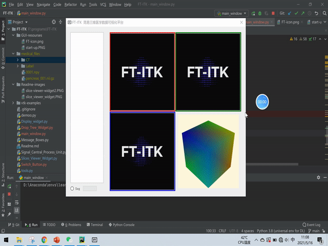
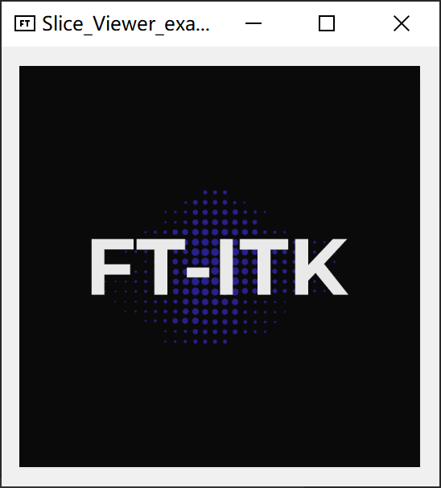

# FT-ITK
# 2021-12-22
没想到竟然快一年过去了，竟然有人渐渐开始关注这个项目了？我受宠若惊！
这是我本科毕业设计时做的一个一个附属项目，而且这个项目现阶段是不成熟的，十分汗颜！
我决定先更新一下我最后毕设答辩时候用的演示视频，和毕业论文关于这个FT-ITK的设计文档部分。
现阶段太忙了，如何日后有精力，我会尽可能完善它！（毕竟不想让本科时瞎折腾学的pyqt浪费)

# 介绍
It aims to build a python-written and simple medical images visualization platform for the convenience of plugging deep-learning model by the researchers in this field.

旨在建造一个python编写、尽可能简易的医学影像可视化平台（可融合深度学习模型），方便广大在医学影像领域研究的同行们。

developing...

开发中.....

## Slices_Viewer_Widget
a unit that visualize 2d slices with mouse scrolling event supported.

一个支持鼠标滚轮操作的2Dslices可视化单元。

You can run Slices_Viewer_Widget.py directly, and the running outcome would be as follows.

可直接运行Slices_Viewer_Widget.py，运行结果如下图。

